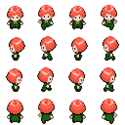

# 🎮 **Overdosed on Overtime**

> **Short Pitch**: Collect as many randomly spawning items as you can in a minute without colliding with enemies or
> objects.
> The player can only change the direction of the character with WASD. Play alone or against your friends in local
> multiplayer mode!

---

## 🌐 **Play the Game**

[Click here to play the game!](https://philipm15.github.io/CCL1/)

---

## 📸 **Screenshots**

### Main Gameplay:

  
  
*Figure 1: Example of gameplay in action.*

---

### Menu and UI:

  
  
  
*Figure 2: Menu and user interface.*

---

## 🎨 **Spritesheets**

Below are the sprites used to create characters and objects in the game:

### Player Character:

  

  
*Figure 3: Player character animations.*

---

### Enemies and NPCs:

  
  
*Figure 4: Enemy animations.*

---

### Level Building

In addition to custom sprites, the following free tiles from itch.io were used to create the game levels:
[Limezu @ itch.io](https://limezu.itch.io/moderninteriors/devlog/244045/free-version-overview-18042021-update)

## 🛠️ **Development**

### **Adding new levels:**

Download Tiled: [Tiled Map Editor](https://www.mapeditor.org/)

- **Tiled:** The game levels are created using Tiled, a free and open-source map editor. The levels are exported as JSON
  files and loaded into the game using a custom importer.
  There needs to be a layer called `collide` in the Tiled map editor to create collision objects. The game uses this to
  detect collisions.
  The layer called `player_overlay` is used to draw things after the player is drawn, such as table corners or other
  objects that should be drawn on top of the player.
- **Creating new Levels:** Create a new `LevelConfig` object in the `src/game/scenes/levels` directory that implements
  the
  `Level` class. This object imports the JSON file and sets the level properties such as spawn positions and enemies.
- **Adding new Levels:** Add a new options under `pixel-radio-group` in the `main.ts` file to select the new level. Add
  a new case in the `switch` statement in the `Game` class to load the new level.

## ✍️ **Reflection**

### What went well:

- **Code Architecture:** The codebase was well-structured and easy to navigate, making it easier to implement new
  features.
- **Creative Design:** I wanted to implement a style that is very similar to old Pokémon games (Ruby, Sapphire), and I
  think I achieved that.
- **Core Mechanics:** Adding a score system and a timer made the game more engaging and was quite easy to implement.
- **Local Multiplayer:** Implementing a local multiplayer mode was a fun challenge and added a competitive edge to the
  game.
- **Controls:** Using linear interpolation for movement made the controls feel smooth and responsive.
- **Map Building:** Using Tiled to create levels made it easy to design and implement new levels. Writing a custom
  importer for the json files was a fun challenge.

### Challenges:

- **Time Constraints:** Implementing additional features like power-ups and more levels was challenging due to time
  constraints.
- **Camera Movement:** Implementing a camera that follows the player was difficult and required a lot of tweaking and
  was ultimately scrapped.
- **Fun Mechanics:** Actually making the game fun was a challenge, as the core mechanics were simple and needed to be
  engaging. I
  scrapped my initial idea of making a stealth/puzzle game because adding a lot of micro-interactions was very
  time-consuming and I didn't want to play the game myself in the end.
- **Movement:** Implementing movement was difficult because I wanted the player to move in a grid-like fashion, but also
  have smooth movement. This was difficult to implement and required a lot of tweaking. I ended up using linear
  interpolation to make the movement feel smooth. This works for the game because the players moves automatically and
  only controls the direction, but it would not work for a game where the player has to move manually.
- **Creating Assets:** Creating custom sprites and animations was very time-consuming even tho I used a free template.
  Pixel Art is hard.

### Lessons Learned:

- **Planning:** Planning out the game and its features before starting development would have made the process smoother.
  I changed a lot of things in the codebase because I didn't plan out the game properly (e.g. UI management, such as
  showing different windows).
- **Focus:** Focus on the core mechanics and make sure they are engaging before adding additional features. Get it
  running and polish later.
- **Talk to Others:** Getting feedback from others early on would have helped me identify issues with the game and make
  it more fun.